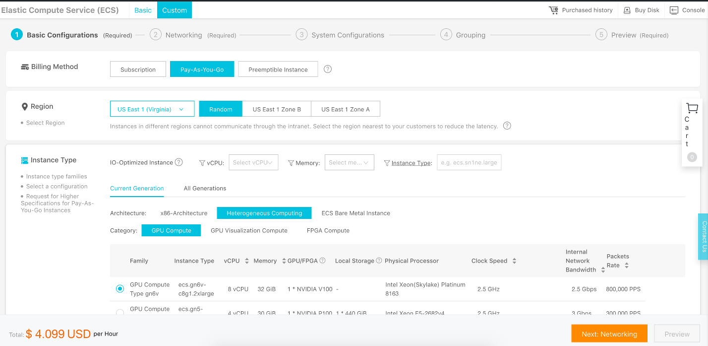
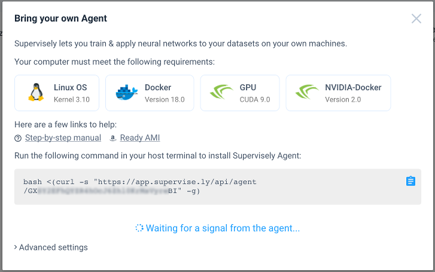
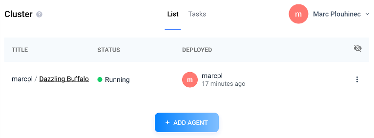

# Supervisely Agent on Alibaba Cloud

## Summary
0. [Introduction](#introduction)
1. [Prerequisite](#prerequisite)
2. [Region and instance type](#region-and-instance-type)
3. [Agent creation](#agent-creation)
4. [Agent decommissioning](#agent-decommissioning)

## Introduction
The goal of this project is to create and delete [cluster agents](https://docs.supervise.ly/cluster/agent/agent/)
easily for [Supervisely](https://supervise.ly/) by using [Alibaba Cloud](https://www.alibabacloud.com/).

This solution can be very handy for people who don't own a computer powerful enough to run intensive computational
tasks such as neural network training. In addition, it is also cost effective as it allows us to pay for a machine
only when we need it.

## Prerequisite
Please [create an Alibaba Cloud account](https://www.alibabacloud.com/help/doc-detail/50482.htm) and
[obtain an access key id and secret](https://www.alibabacloud.com/help/faq-detail/63482.htm).

The scripts in this projects are written for [Terraform](https://www.terraform.io), please
[install it on your computer](https://www.terraform.io/intro/getting-started/install.html).

## Region and instance type
Supervisely requires virtual machines with Nvidia GPUs, Alibaba Cloud provides this type of machines in
[several regions around the world](https://www.alibabacloud.com/help/doc-detail/40654.htm). The first task is to choose
the region and the instance type (= virtual machine type):
* Log in to [Alibaba Cloud](https://www.alibabacloud.com/).
* Go to the [ECS console](https://ecs.console.aliyun.com/) ("ECS" the product name corresponding to virtual machines).
* Click on the "Create Instance" button.
* The new page should be a wizard similar to this screenshot:



Note: if the page you see is different, maybe you are in the "basic mode", please click on the "Advanced Purchase" tab.

* Set the billing method to "Pay-As-You-Go".
* Select the closest region to your location.
* Set the instance type architecture to "Heterogeneous Computing".
* Select the instance type that suits your needs (e.g. "ecs.gn5-c4g1.xlarge").

Check the price at the bottom of the page, select another region and check how it changes: the price varies quite a
lot between regions. As of January 2019, the cheapest region is US East 1 (Virginia).

You can change other parameters such as the storage disk in order to see how the price evolves. The
[main script](main.tf) sets the system disk at "SSD Cloud Disk" 300 GiB and assigns a public IP address with
a maximum bandwidth of 1 Mbps.

Do not follow the wizard until the end, stop after you choose your region and instance type.

In order to continue to the next step, you should have the following information:
* A region - please pick the corresponding region id from
  [this document](https://www.alibabacloud.com/help/doc-detail/40654.htm) (for example, the region id for
  "US East 1 (Virginia)" is "us-east-1").
* An instance type (e.g. "ecs.gn5-c4g1.xlarge").

## Agent creation
In order to create an agent for Supervisely, download this project on your computer, then open a terminal and type:
```bash
cd path/to/this/project

export ALICLOUD_ACCESS_KEY="your-accesskey-id"
export ALICLOUD_SECRET_KEY="your-accesskey-secret"
export ALICLOUD_REGION="your-region-id"

export TF_VAR_instance_type="ecs.gn5-c4g1.xlarge"
export TF_VAR_ecs_root_password="your-root-password"

terraform init
terraform apply
```
Notes:
* The commands above are for Linux and MAC OSX, you will need to adapt them if you use Windows.
* The `TF_VAR_ecs_root_password` variable should contain the root password for your virtual machine.

The last command should display a plan describing the resources that will be created and ask you to confirm by
typing yes. The Terraform script should take few minutes to create the cloud resources, to install the required
software and to reboot the machine.

Once finished, the terraform script should output the public IP address of your agent:
```
alicloud_instance.agent_ecs: Creation complete after 8m12s (ID: i-0xi08rtchivyuoj24li9)

Apply complete! Resources: 5 added, 0 changed, 0 destroyed.

Outputs:

agent_ecs_public_ip = 47.89.191.243
```

The machine is now ready to be registered on Supervisely:
* Log in to [Supervisely](https://app.supervise.ly/login).
* Navigate to the [Cluster page](https://app.supervise.ly/nodes/list).
* Click on the "ADD AGENT" button.
* A popup should appear, copy the command at the bottom.



Note: in the screenshot above, the command should be something like:
```bash
bash <(curl -s "https://app.supervise.ly/api/agent/some-token" -g)
```

You can now execute this command on your machine via SSH:
```bash
# Create a variable that contains the ip address of your agent (e.g. 47.89.191.243)
AGENT_IP_ADDR=$(terraform output agent_ecs_public_ip)

# Run the Supervisely command on your agent (put single quotes '' around it)
# Note: use the password you set earlier in the "TF_VAR_ecs_root_password" variable
ssh "root@${AGENT_IP_ADDR}" 'bash <(curl -s "https://app.supervise.ly/api/agent/some-token" -g)'
```
After few minutes the agent should be ready for Supervisely and will print the following logs:
```
============ You can close this terminal safely now ============
{"message": "ENVS", ...
{"message": "Agent comes back...", ...
{"message": "Searching for missed containers...", ...
{"message": "There are no missed containers.", ...
{"message": "Agent is ready to get tasks.", ...
{"message": "Will connect to server.", ...
{"message": "Connected to server.", ...
{"message": "TELEMETRY_REPORTER_INITIALIZED", ...
{"message": "IMAGE_STREAMER_INITIALIZED", ...
```
You can close your terminal by pressing CTRL+C.

If you look at the cluster page in Supervisely, your agent should have the status "Running":



## Agent decommissioning
A nice thing with Terraform is that it becomes easy to destroy and re-create virtual machines, so we just pay
when we need them.

When you have finished with your agent, you need to first disable it in Supervisely:
* If necessary, log in to [Supervisely](https://app.supervise.ly/login).
* Navigate to the [Cluster page](https://app.supervise.ly/nodes/list).
* Click on the "three dots" button on the right of your agent.
* Click on "Disable" and confirm.

You can now safely release the virtual machine and all other related cloud resources. Open a terminal and type:
```bash
cd path/to/this/project

export ALICLOUD_ACCESS_KEY="your-accesskey-id"
export ALICLOUD_SECRET_KEY="your-accesskey-secret"
export ALICLOUD_REGION="your-region-id"

terraform destroy
```
The last command should show all resources that will be destroyed and ask you to confirm by typing yes. The command
should finish with the following logs:
```
Destroy complete! Resources: 5 destroyed.
```
